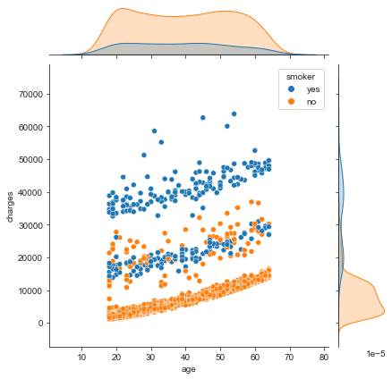
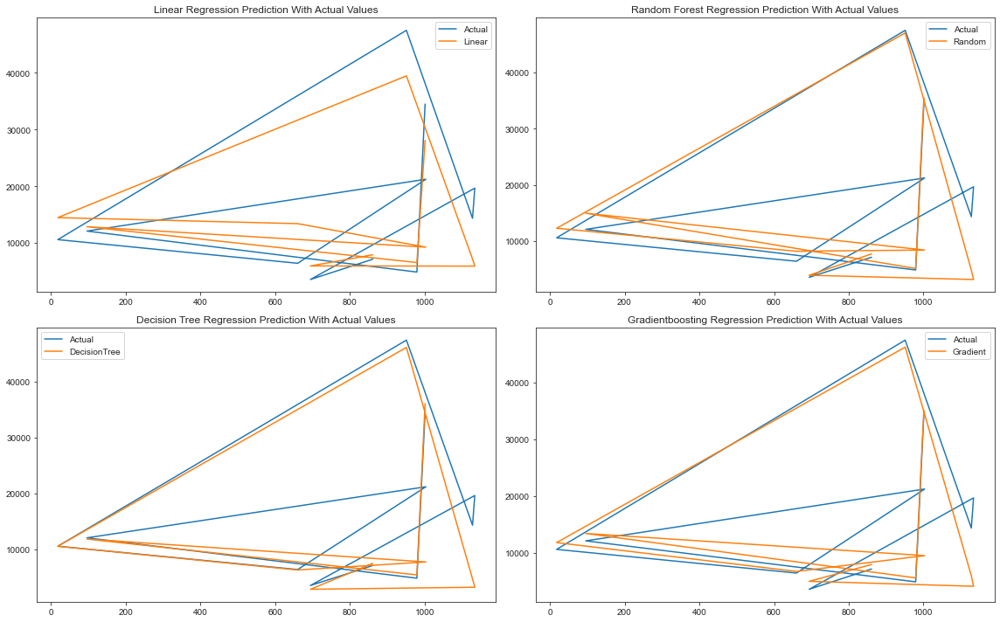

# Insurance-Premium-Prediction

# Health Insurance

Health insurance is an agreement whereby insurance company agrees to undertake a guarantee of compensation for medical expenses in case the insured falls ill or meets with an accident which leads to hospitalization of the insured. Generally, insurance companies have tie-ups with the leading hospitals so as to provide cashless treatment to the insured. In case the insurance company has no tie-ups with the hospital, they reimburse the cost of expenses incurred by the insured. The government also promotes health insurance by providing a deduction from income tax.

## Importance of Health Insurance
Buying a health insurance policy for yourself and your family is important because medical care is expensive, especially in the private sector. Hospitalisation can burn a hole in your pocket and derail your finances. It will become even tough, if the person who brings in the money, is now in a hospital bed. All this can be avoided by just paying a small annual premium which would lessen your stress in case of medical emergencies. A good health insurance policy would usually cover expenses made towards doctor consultation fees, costs towards medical tests, ambulance charges, hospitalization costs and even post-hospitalization recovery costs to a certain extent.

The problem is to predict the charges for health insurance.

The below steps are followed in a Machine Learning process:

## Step 1: Define the objective of the Problem Statement

## Objective of the Project
The purposes of this project to look into different features to observe their relationship, and plot a regression based on several features of individual such as age, physical/family condition and location against their existing medical expense to be used for predicting future medical expenses of individuals that help medical insurance to make decision on charging the premium.

## Step 2: Data Gathering

Dataset link - https://www.kaggle.com/datasets/mirichoi0218/insurance

## Step 3: Data Preparation

The data you collected is almost never in the right format. You will encounter a lot of inconsistencies in the data set such as missing values, redundant variables, duplicate values, etc. Removing such inconsistencies is very essential because they might lead to wrongful computations and predictions. Therefore, at this stage, you scan the data set for any inconsistencies and you fix them then and there.

## Step 4: Exploratory Data Analysis

Exploratory Data Analysis is an approach in analyzing data sets to summarize their main characteristics, often using statistical graphics and other data visualization methods.

## Step 5: Building a Machine Learning Model

All the insights and patterns derived during Data Exploration are used to build the Machine Learning Model. This stage always begins by splitting the data set into two parts, training data, and testing data. The training data will be used to build and analyze the model. The logic of the model is based on the Machine Learning Algorithm that is being implemented.

### Formulating a regression analysis helps you predict the effects of the independent variable on the dependent one.

Regression is a technique for  investigating the relationship between independent variables or features and a dependent variable or outcome. It’s used as a method for predictive modelling in machine learning, in which an algorithm is used to predict continuous outcomes.  

### Algorithms
    - Linear Regression
    - Decision Tree 
    - Random Forest
    - Gradient Boosting

## Step 6: Model Evaluation 

After building a model by using the training data set, it is finally time to put the model to a test. The testing data set is used to check the efficiency of the model and how accurately it can predict the outcome. Once the accuracy is calculated, any further improvements in the model can be implemented at this stage.

In this case we have used:-

1. Scatter plot for y_test Vs predictions
2. R-squared value for training and testing data
3. Regression Evaluation Metrics
    - Mean Absolute Error (MAE) 
    - Mean Squared Error (MSE)
    - Root Mean Squared Error (RMSE)
4. By plotting, Comparing Performances of all model predictions with actual value

## Step 7: Predictions

Once the model is evaluated and improved, it is finally used to make predictions.
We are going to predict charges of insurance.

# Top Insights

## Charges Vs age and hue="smoker"

Well, health insurance premium increases with age. 

The younger you are, the lower your premium will be. Likewise, the older you are, the higher your health insurance premium will be. 

Since at a young age, the chances of encountering health conditions and visiting the doctor is low, the cost of health insurance premium is low. 

However, with the increasing age, the probabilities of a person facing health issues and visiting doctors rise, thereby increasing the premium amount as well. 

Health insurance and smoking do not go hand-in-hand. You must understand that how they are related to each other in order to realize how tobacco consumption can affect your finances. Smoking can impact the medical coverage costs to a great extent. Health insurance rates are determined by the insurance companies differently for individuals who smoke.

- The smoker has more charges of insurance.
Since health risks are higher for smokers, insurance companies charge a higher premium to mitigate the risks associated with it.

## Charges vs bmi

Your BMI signifies healthy you are. A higher BMI means that you are more susceptible to coronary heart diseases and other illnesses like diabetes and other weight-related diseases. Concurrently, the medical treatment, along with the cost of medication required for such conditions is high.

Insurance companies use BMI to determine what your premium amount should be. The reason behind this is pretty straightforward. If they anticipate that your medical spending is bound to be more, it makes a direct impact on your premiums. Higher the expenditure, the higher will be your premium.
You should note that these figures are a mere indication of how healthy you are. However, they are not binding and final. For example, an athlete or a very fit person may have a high BMI. The excess weight, in this case, might be due to muscle mass, and they cannot be classified as overweight or obese. Hence though BMI is beneficial, it is just one of the many steps in deciding how healthy you are.

## Machine Learning Applied

Here's all results of the machine learning models with their default parameters.

| Model	                     |MAE	        |MSE	      |RMSE	        |R2_Score(training)	|R2_Score(test) |
|:--------------------------:|:------------:|:-----------:|:-----------:|:-----------------:|:-------------:|
|Linear Regression	         |4490.665575	|4.152710e+07 |	6444.152418	| 0.751233	        | 0.745582
| Decision Tree Regressor	 |3033.020790	|3.986428e+07 | 6313.816274	| 0.998796	        | 0.755770
| Random Forest Regressor	 |2704.455985	|2.371827e+07 | 4870.141058	| 0.975445	        | 0.854689
| Gradient Boosting Regressor|	2488.850533	|1.883126e+07 |	4339.499949	| 0.896297	        | 0.884629

## Comparing Performances of all model predictions with actual value

Gradientboosting regression prediction is close to actual values which is vissible from "Gradientboosting Regression Prediction With Actual Values" plot.

# Conclusion

- Gradientboosting model is used to predict, on the basis of R squared value for testing and Mean Absolute Error(MAE) value.

- The predictions of gradientboosting model is close to actual charges value.

- There is some difference in the predicted value and charges (given in the dataset).

- There is scope for model optimization to predict values accurately.
